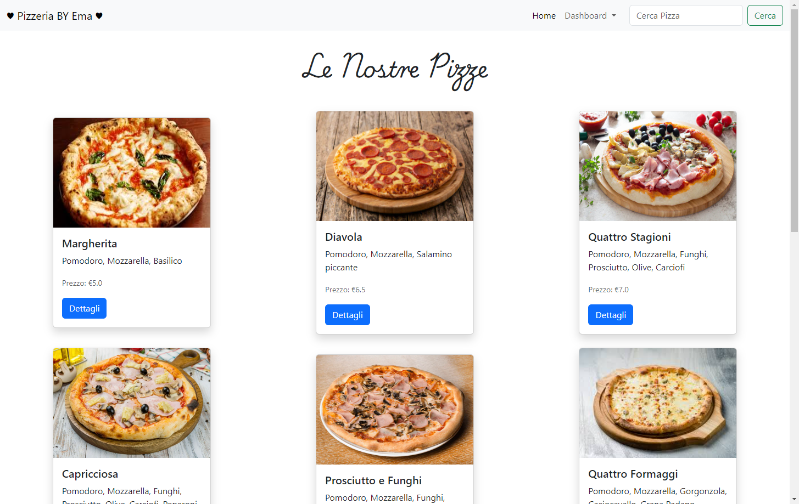
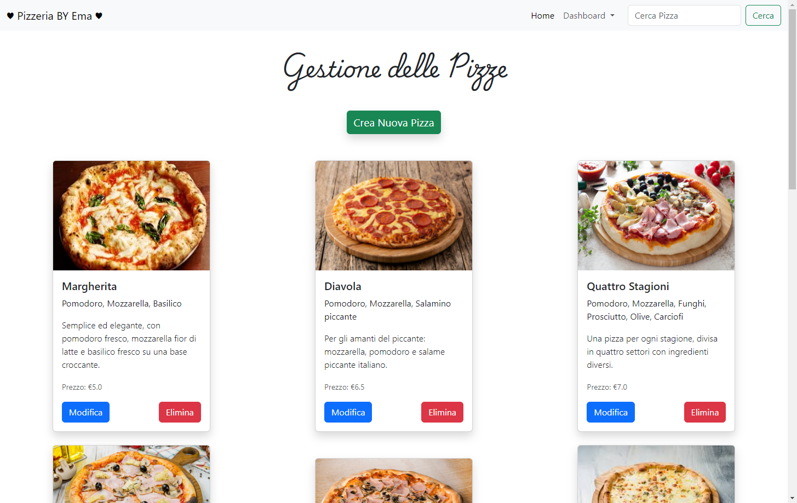
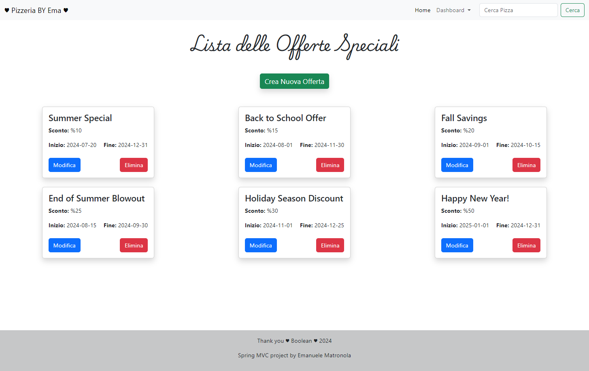
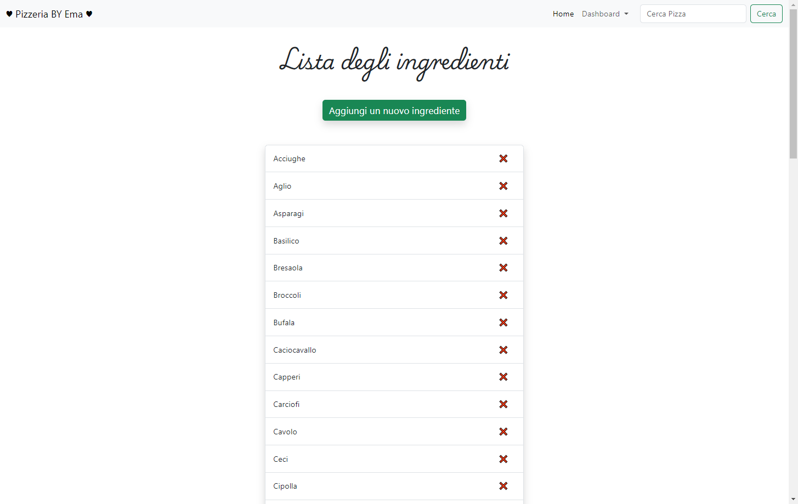
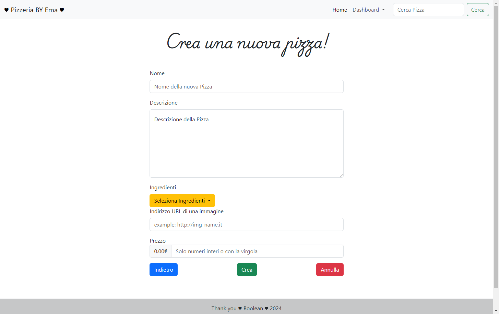
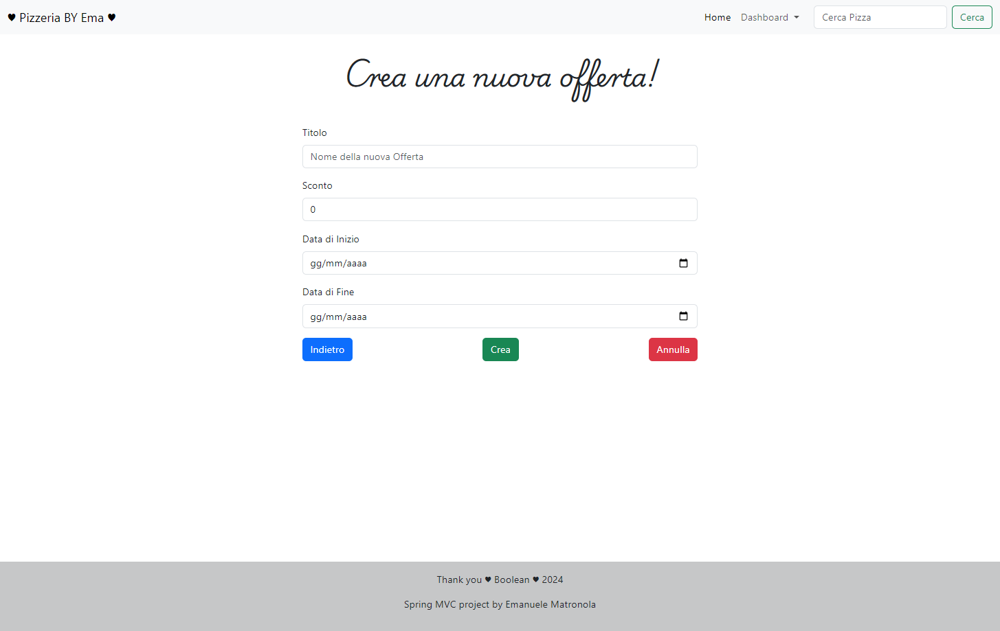
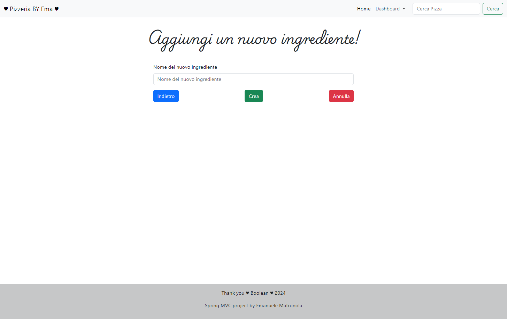
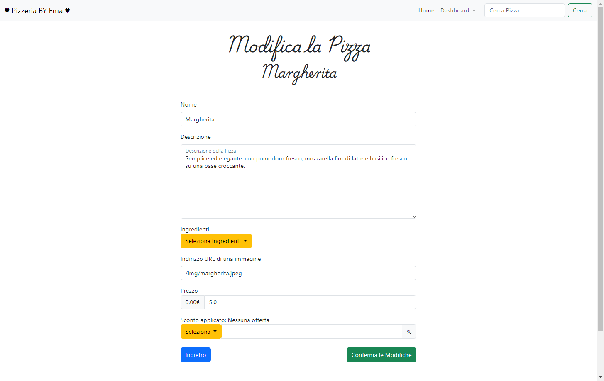
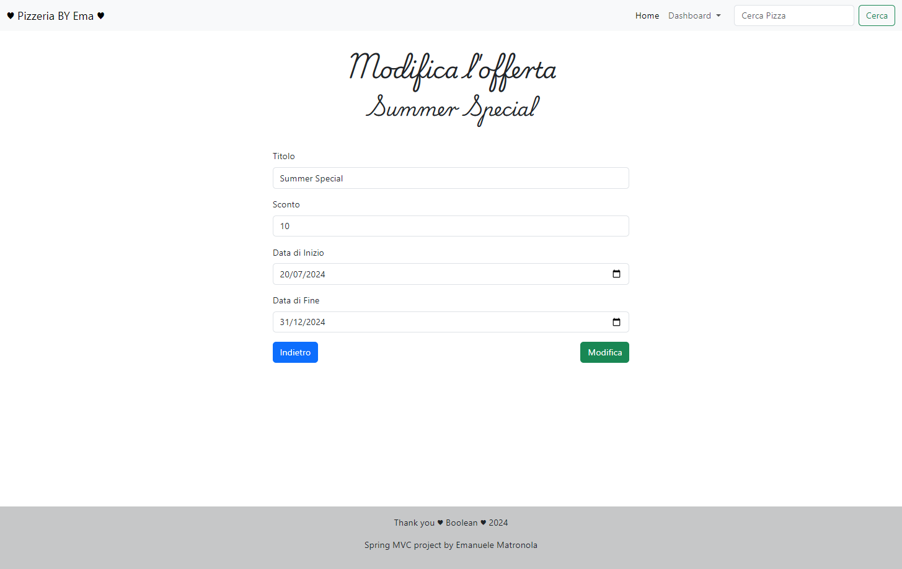

# la-mia-pizzzeria-relazioni_MySQL DataBase

## Index

## Index

## Index

## Index

## Index

## Index

## Index

## Index

## Index

## Esercizio di oggi: Spring La Mia Pizzeria Relazioni
___________________________________________________________________________________________________

### Nuova importante funzionalità : le offerte speciali!

In alcuni momenti potremmo voler vendere le nostre pizze a un prezzo scontato.
Dobbiamo quindi predisporre tutto il codice necessario per poter collegare un’offerta speciale a una pizza (in una relazione 1 a molti, cioè un’offerta speciale può essere collegata a una sola pizza, e una pizza può essere collegata a più offerte speciali).

L’offerta speciale avrà :
- una data di inizio
- una data di fine
- un titolo

La pagina di dettaglio della singola pizza mostrerà l’elenco delle offerte collegate e avrà un bottone “Crea nuova offerta speciale” per aggiungerne una nuova.
Accanto ad ogni offerta speciale è previsto un bottone che mi porterà a una pagina per modificarla.

___________________________________________________________________________________________________

### Nuovo pezzettino per la nostra pizzeria : gli ingredienti!
Ogni pizza può avere più ingredienti, e ogni ingrediente può essere collegato a più pizze.

Prevediamo quindi:
1) Una pagina per mostrare l’elenco di tutti gli ingredienti che utilizziamo nella nostra pizzeria;
2) che permetta anche di crearne di nuovi (e di cancellarli).
3) Nella pagina di creazione (e modifica) della singola pizza dobbiamo dare la possibilità di collegare uno o più ingredienti.